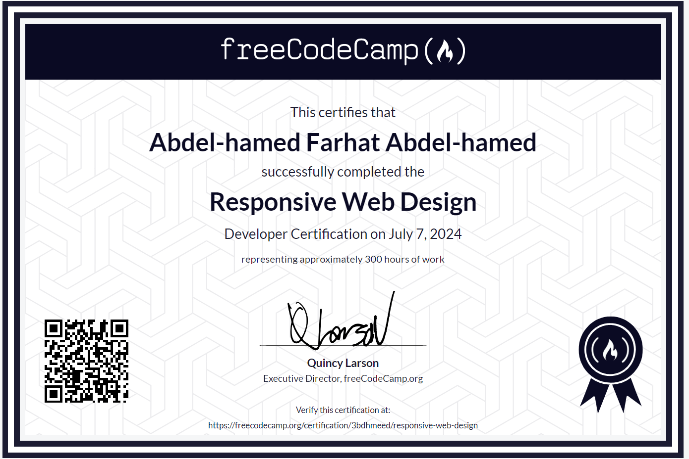

# Web Design Certification Projects

Welcome to my journey through the freeCodeCamp Web Design Certification! This repository showcases all the projects I've completed during my learning adventure. Each project is an example of my growth and exploration in web design. Enjoy browsing through my creations!

## Projects

### 1. [Cat Photo App](01%20-%20Cat%20Photo%20App)
A simple and fun project that showcases various cat photos.

### 2. [Cafe Menu](02%20-%20Cafe%20Menu)
A stylish cafe menu designed to tantalize your taste buds.

### 3. [Color Markers](03%20-%20Color%20Markers)
A vibrant display of color markers in a neat layout.

### 4. [Registration Form](04%20-%20Registration%20Form)
A clean and user-friendly registration form for new users.

### 5. [Survey Form](05%20-%20Survey%20Form)
An engaging survey form to gather user feedback.

### 6. [Rothko Painting](06%20-%20Rothko%20Painting)
A digital representation of a Rothko painting.

### 7. [Photo Gallery](07%20-%20Photo%20Gallery)
A beautifully arranged photo gallery showcasing stunning images.

### 8. [Nutrition Label](08%20-%20Nutrition%20Label)
An informative and accurate nutrition label.

### 9. [Quiz](09%20-%20Quiz)
An interactive quiz to test your knowledge.

### 10. [Tribute Page](10%20-%20Tribute%20Page)
A tribute page dedicated to a person or topic of significance.

### 11. [Balance Sheet](11%20-%20Balance%20Sheet)
A detailed and organized balance sheet.

### 12. [Cat Painting](12%20-%20Cat%20Painting)
An artistic rendering of a cat painting.

### 13. [Piano](13%20-%20Piano)
A mini-project simulating a piano.

### 14. [Java Documentation](14%20-%20Java%20Documentation)
A comprehensive documentation page for Java.

### 15. [City Skyline](15%20-%20City%20Skyline)
A captivating view of a city skyline.

### 16. [Magazine](16%20-%20Magazine)
A magazine layout with engaging content.

### 17. [Product Landing Page](17%20-%20Product%20Landing%20Page)
A sleek and attractive landing page for a product.

### 18. [Ferris Wheel](18%20-%20Ferris%20Wheel)
A creative representation of a ferris wheel.

### 19. [Penguin](19%20-%20Penguin)
A cute and delightful penguin design.

### 20. [Personal Portfolio Webpage](20%20-%20Personal%20Portfolio%20Webpage)
A personal portfolio showcasing my work and skills.

## About

This repository is a testament to my dedication and passion for web design. Each project reflects my learning progress and creativity. Feel free to explore and provide feedback!

## Contact

If you have any questions or would like to connect, you can reach me through:

- **GitHub:** [3bdhmeed](https://github.com/Assembleon)
- **Email:** [3bdhmeed@gmail.com](mailto:3bdhmeed@gmail.com)

Thank you for visiting my repository!

-----
